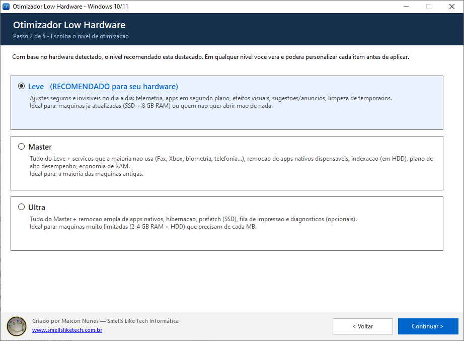
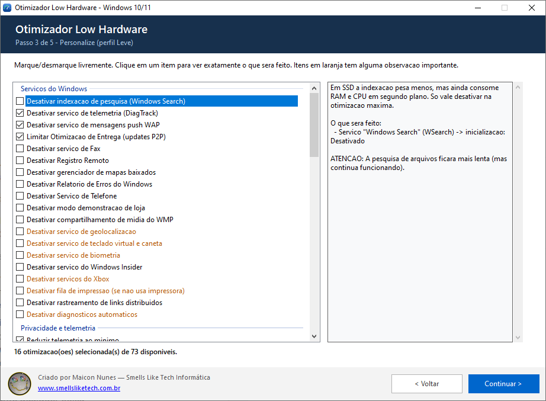
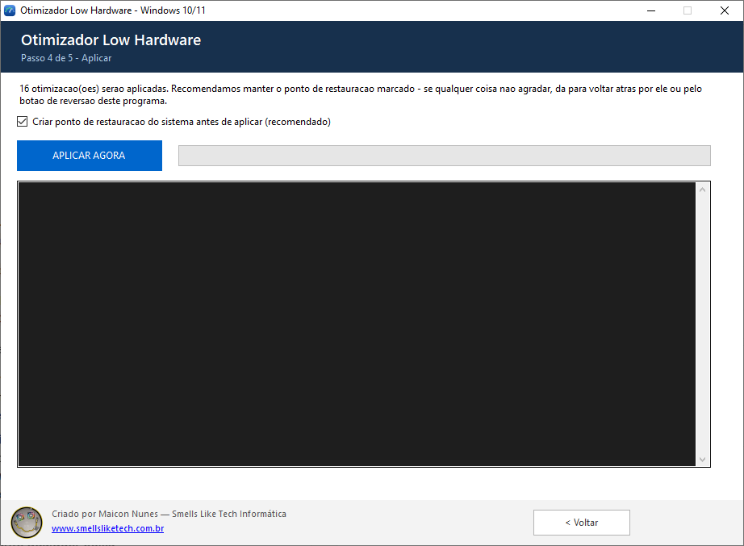
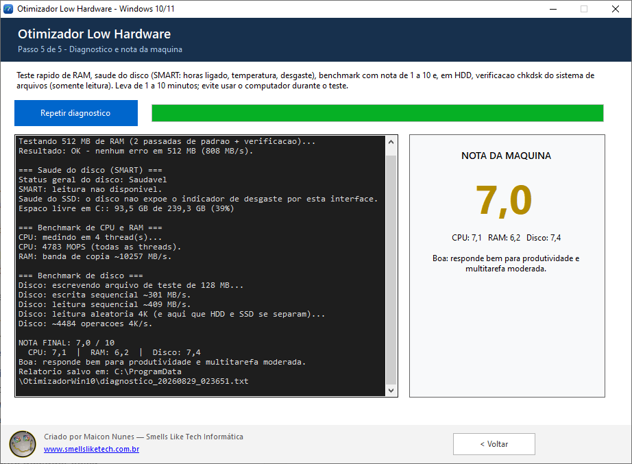
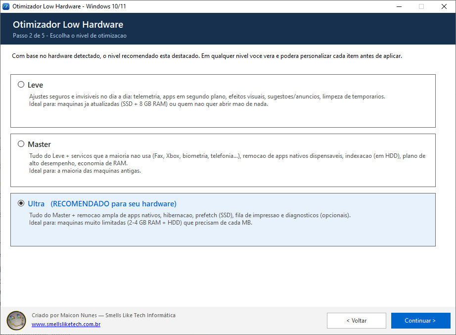
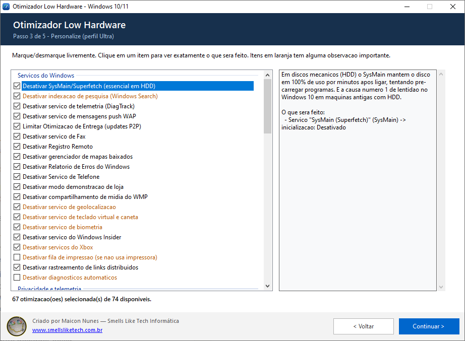
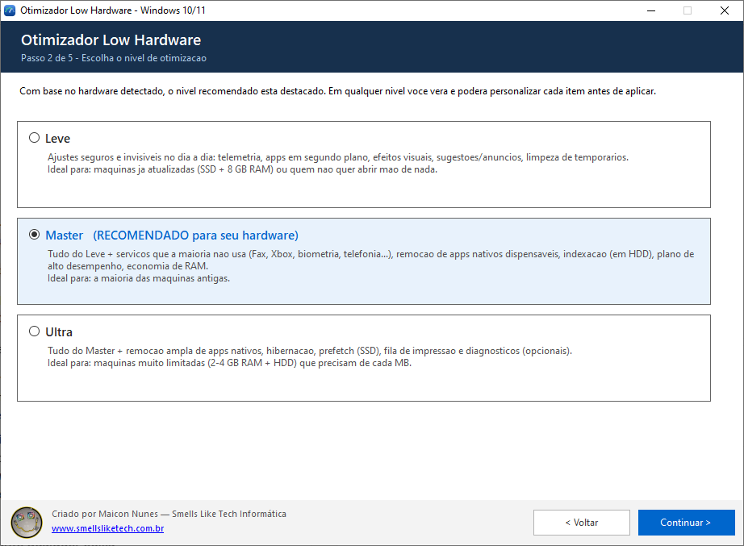
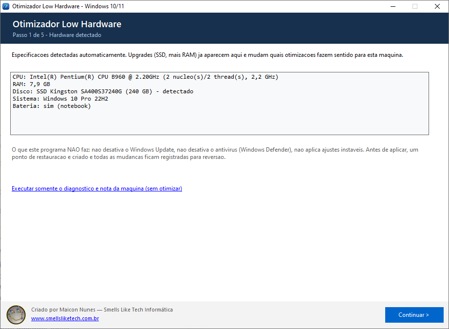

# Otimizador Low Hardware — Windows 10 / 11

**Programa de bancada que detecta o hardware da máquina, decide sozinho o nível de
otimização adequado e enxuga o Windows 10/11 em computadores fracos ou antigos — com
tudo explicado item por item, tudo desmarcável e tudo reversível.**

> Criado por **Maicon Nunes** — Smells Like Tech Informática — www.smellsliketech.com.br

<p align="center">
  
</p>

---

## Índice

- [Para que serve](#para-que-serve)
- [Linguagem e tecnologia](#linguagem-e-tecnologia)
- [O programa em 5 passos (com prints)](#o-programa-em-5-passos-com-prints)
- [Como o software escolhe o perfil](#como-o-software-escolhe-o-perfil)
- [Exemplos de hardware e o que é setado em cada um](#exemplos-de-hardware-e-o-que-é-setado-em-cada-um)
- [O que o catálogo contém](#o-que-o-catálogo-contém)
- [Racional técnico das otimizações](#racional-técnico-das-otimizações)
- [O que o programa NÃO faz](#o-que-o-programa-não-faz)
- [Antivírus: por que aparece alerta e por que o software é seguro](#antivírus-por-que-aparece-alerta-e-por-que-o-software-é-seguro)
- [Reversão](#reversão)
- [Diagnóstico e nota de 1 a 10](#diagnóstico-e-nota-de-1-a-10)
- [Como compilar](#como-compilar)
- [Estrutura do código](#estrutura-do-código)

---

## Para que serve

É uma ferramenta de assistência técnica: um **único .exe, sem instalação e sem
dependências**, que se leva no pen drive até a máquina do cliente. Ao abrir, ele:

1. lê o hardware por WMI (CPU, RAM, tipo/modelo/tamanho do disco de sistema, bateria,
   versão real do Windows);
2. calcula qual dos três perfis — **Leve**, **Master** ou **Ultra** — faz sentido
   para *aquela* máquina;
3. mostra a lista completa de otimizações aplicáveis, com a descrição literal do que
   cada uma altera e quais efeitos colaterais tem, para o técnico marcar e desmarcar
   o que quiser;
4. cria ponto de restauração, aplica com log ao vivo e grava um **arquivo de reversão**
   com o estado anterior de cada serviço e cada chave de registro;
5. roda um diagnóstico (memória, saúde SMART do disco, benchmark) e dá uma **nota de 1
   a 10** para a máquina, com veredito e relatório salvo em disco.

O ponto central é que **o conjunto de otimizações muda conforme o hardware**. Não é uma
lista fixa: um notebook com HDD recebe ajustes que seriam inúteis (ou até prejudiciais)
em SSD, e vice-versa. Se a máquina recebeu upgrade de SSD ou de RAM, o programa percebe
sozinho na inicialização e recomenda outra coisa — sem perguntar nada ao usuário.

**Público-alvo típico:** Positivo Motion Q232, Acer Aspire E1-531, Samsung RV410,
notebooks Samsung/Positivo com Celeron e 4 GB, e qualquer máquina de fábrica fraca com
Windows 11.

---

## Linguagem e tecnologia

| Item | Valor |
|---|---|
| **Linguagem** | **C#** (restrito à sintaxe do **C# 5**) |
| **Framework** | .NET Framework 4.x (já vem no Windows 10/11 — nada para instalar no cliente) |
| **Interface** | **WinForms**, layout 100% escrito em código (sem Designer, sem `.resx`) |
| **Compilador** | `csc.exe` que acompanha o Windows (`%WINDIR%\Microsoft.NET\Framework64\v4.0.30319`) |
| **Build** | `build.bat` — **sem Visual Studio, sem SDK, sem NuGet** |
| **Saída** | `bin\OtimizadorWin10.exe` (~1,4 MB, autossuficiente; ícone e logo embutidos) |
| **APIs usadas** | WMI (`System.Management`), `System.ServiceProcess`, `Microsoft.Win32.Registry`, `JavaScriptSerializer` (JSON do undo), P/Invoke Win32 (`CreateFileW`/`ReadFile`/`VirtualAlloc` para I/O sem cache) |
| **Privilégios** | `requireAdministrator` no `app.manifest` (necessário para serviços, HKLM, SMART e chkdsk) |
| **Idioma da interface** | Português do Brasil |

> A restrição a C# 5 é proposital: o compilador embutido no Windows é o legado da pasta
> `v4.0.30319`. Nada de interpolação de string, `?.`, `nameof`, tuplas ou pattern
> matching — em troca, o projeto compila em qualquer máquina Windows recém-formatada,
> sem instalar absolutamente nada.

---

## O programa em 5 passos (com prints)

### Passo 1 — Hardware detectado

Detecção automática por WMI. O tipo do disco vem em cascata:
`MSFT_PhysicalDisk.MediaType` → `SpindleSpeed` (0 = sem partes móveis = SSD) →
heurística pelo modelo. A versão do Windows é decidida pelo **build** (≥ 22000 = Windows 11),
porque o registro do Windows 11 ainda se declara "Windows 10".


### Passo 2 — Perfil recomendado

Três níveis, com o recomendado já destacado e selecionado. O técnico pode escolher outro.



### Passo 3 — Personalização item a item

Lista agrupada por categoria, com checkbox em cada linha. Clicando em um item, o painel
da direita mostra **exatamente** o que será feito (serviço, chave de registro, comando,
pacote a remover) e o aviso de efeito colateral, quando existe. Itens com observação
importante aparecem em laranja.



### Passo 4 — Aplicação com log ao vivo

Cria o ponto de restauração (opcional, marcado por padrão), aplica ação por ação, mostra
o log em tempo real e grava o arquivo de reversão. Falhas não críticas viram **AVISO**,
não FALHA.



### Passo 5 — Diagnóstico e nota

Teste de memória, saúde do disco (SMART), benchmark de CPU, RAM e disco (incluindo
leitura aleatória 4K sem cache) e, em HDD, `chkdsk` somente leitura. No fim, nota de 1 a 10.



> *Print capturado em um i5-6500 com SSD SATA. A linha "SMART: leitura não disponível"
> aparece porque a captura foi feita por um harness de testes sem elevação; o executável
> real roda como administrador e traz horas ligado, temperatura, setores realocados e
> desgaste do SSD.*

---

## Como o software escolhe o perfil

A recomendação é uma pontuação simples e determinística (`HardwareInfo.TierRecomendado`):

| Condição detectada | Pontos |
|---|---|
| Disco **não é SSD** (HDD, ou tipo indeterminado) | **+2** |
| RAM ≤ 2,5 GB | **+2** |
| RAM entre 2,5 GB e 4,5 GB | **+1** |
| CPU com ≤ 2 núcleos **e** menos de 2,6 GHz | **+1** |

| Pontuação | Perfil recomendado |
|---|---|
| 0 – 1 | **Leve** |
| 2 – 3 | **Master** |
| ≥ 4 | **Ultra** |

Os perfis são cumulativos: **Leve** ⊂ **Master** ⊂ **Ultra**. O perfil define apenas o
que vem **pré-marcado**; a lista inteira continua visível e editável.

---

## Exemplos de hardware e o que é setado em cada um

Os números abaixo foram gerados rodando o catálogo real do programa contra cada
configuração ("disponíveis" = itens que se aplicam àquele hardware/versão de Windows;
"pré-marcadas" = itens já selecionados no perfil recomendado; "opt-in" = itens que
aparecem mas exigem marcação manual por serem arriscados).

> **Sobre os prints desta seção:** são a interface real do programa, alimentada com as
> especificações de cada máquina através de um harness de testes — a mesma técnica usada
> para validar os perfis sem precisar ter as nove máquinas na bancada. A tela, o
> catálogo, as condições de hardware e a recomendação são exatamente os do produto.

| Máquina | CPU | RAM | Disco | Windows | Perfil | Disponíveis | Pré-marcadas | Opt-in |
|---|---|---|---|---|---|---|---|---|
| **Positivo Motion Q232** | Celeron N3010 (2C/2T) | 4 GB DDR3L | HDD 500 GB | 10 | **Ultra** | 74 | 67 | 7 |
| Positivo Q232 **após upgrade de SSD** | Celeron N3010 | 4 GB | SSD 240 GB | 10 | **Master** | 75 | 55 | 0 |
| **Celeron N2840 + 4 GB DDR3** | Celeron N2840 (2C/2T) | 4 GB DDR3 | HDD 500 GB | 10 | **Ultra** | 74 | 67 | 7 |
| **Acer Aspire E1-531** (original) | Pentium B960 (2C/2T) | 4 GB DDR3 | HDD 500 GB | 10 | **Ultra** | 74 | 67 | 7 |
| **Acer E1-531 com upgrade** | Pentium B960 | 8 GB DDR3 | SSD 240 GB | 10 | **Leve** | 73 | 16 | 0 |
| **Samsung RV410** | Pentium P6100 (2C/2T) | 2 GB DDR3 | HDD 320 GB | 10 | **Ultra** | 74 | 67 | 7 |
| **Notebook Celeron 5205U** | Celeron 5205U (2C/2T) | 4 GB | SSD 256 GB | 11 | **Master** | 87 | 64 | 0 |
| Mesmo notebook **com HDD** | Celeron 5205U | 4 GB | HDD 1 TB | 11 | **Ultra** | 86 | 77 | 9 |
| **Desktop i5-6500** | i5-6500 (4C/4T) | 8 GB | SSD 240 GB | 10 | **Leve** | 73 | 16 | 0 |

### Exemplo 1 — Positivo Motion Q232 (Celeron N3010, 4 GB, HDD) → **Ultra**

O caso clássico de máquina de entrada: CPU de 2 núcleos, 4 GB de RAM e disco mecânico.
Pontuação **4** (HDD +2, RAM 4 GB +1, CPU fraca +1) → **Ultra**.




**67 otimizações pré-marcadas de 74 disponíveis.** O que entra por causa *deste* hardware:

- **SysMain (Superfetch) desativado já no nível Leve** — em HDD é o item de maior
  impacto isolado; é a causa nº 1 de "disco em 100%" nos primeiros minutos após ligar.
- **Windows Search (indexação) desativado** — o indexador disputa I/O com tudo em disco
  mecânico. Em SSD esse mesmo item só apareceria no Ultra.
- **Arquivo de paginação fixo** — o pagefile dinâmico cresce e encolhe e fragmenta o HDD;
  o tamanho é calculado a partir da RAM detectada (mín. = máx.).
- **Agrupamento de processos svchost** (`SvcHostSplitThresholdInKB`) — só é oferecido
  em máquinas com ≤ 4,5 GB; economiza de 100 a 300 MB de RAM.
- **Hibernação vem desmarcada** — em HDD desativá-la mataria a Inicialização Rápida e
  deixaria o boot mais lento. Em SSD ela vem marcada no Ultra.
- **Prefetch NÃO é oferecido** — em disco mecânico ele ajuda; o item só existe para SSD.
- **Plano de energia Alto Desempenho**, com aviso de consumo de bateria por ser notebook.
- **Remoção ampla de apps nativos** (Bing News, Clima, Solitaire, Groove, Skype, Mapas,
  Xbox, 3D Viewer…), cada um como item individual e desmarcável.



> Se essa mesma Q232 receber um SSD, o programa passa a recomendar **Master**: o peso
> "+2" do HDD some, SysMain e indexação deixam de ser críticos, o pagefile fixo some da
> lista e entram TRIM garantido e Prefetch desativado.

### Exemplo 2 — Notebook Celeron 5205U, 4 GB + SSD, Windows 11 → **Master**

Máquina fraca **de fábrica**, já com SSD. Pontuação **2** (RAM 4 GB +1, CPU 2 núcleos a
1,9 GHz +1) → **Master**.




**87 itens disponíveis** — 14 a mais que no Windows 10, porque o catálogo do Windows 11
entra em cena:

- **Widgets desativados** — o painel mantém um processo Edge/WebView permanente; em um
  Celeron com 4 GB é um dos maiores ganhos do Windows 11.
- **Copilot desativado** e **Chat/Teams removido da barra**.
- **Menu de contexto clássico restaurado** — o menu novo do botão direito é
  perceptivelmente mais lento para abrir em CPU fraca.
- **Bloatware que só existe no 11 removido**: Clipchamp, Teams pessoal, MSTeams, To Do,
  Power Automate, Dev Home, novo Outlook, Xbox (app novo), pacote Web Experience.
- **Integridade de Memória (VBS/HVCI)** aparece como item **Ultra e desmarcado por
  padrão**, com aviso explícito de que é recurso de segurança (custa de 5 a 15% de CPU).
- **Não** entram SysMain, indexação, pagefile fixo nem Prefetch — decisões de HDD.
- Entram **TRIM garantido** e o agrupamento de svchost (RAM ≤ 4,5 GB).

> O mesmo notebook com HDD em vez de SSD sobe para **Ultra** (86 itens, 77 pré-marcados):
> volta tudo que é específico de disco mecânico.

### Exemplo 3 — Acer Aspire E1-531 depois do upgrade (8 GB + SSD) → **Leve**

Mesmo notebook antigo de 2012, mas com SSD e memória expandida. Pontuação **1** (só a
CPU fraca) → **Leve**.




**Apenas 16 de 73 itens vêm marcados** — telemetria, tarefas agendadas de coleta, apps em
segundo plano, sugestões/apps promovidos, efeitos visuais, transparência, atraso de menus,
Game DVR, atraso de inicialização, Otimização de Entrega e limpeza de temporários.
Nada de desinstalar app nativo, nada de mexer em serviço que a máquina aguenta rodar.
É exatamente o comportamento desejado: **hardware melhor recebe menos intervenção.**

---

## O que o catálogo contém

Cerca de **90 otimizações** (73 a 87 aplicáveis por máquina), em 7 categorias:

| Categoria | Exemplos |
|---|---|
| **Serviços do Windows** | SysMain, Windows Search, DiagTrack, dmwappushservice, Otimização de Entrega, Fax, Registro Remoto, Mapas, Relatório de Erros, Telefonia, Modo Demonstração, WMP em rede, Geolocalização, Teclado Virtual/Caneta, Biometria, Windows Insider, 4 serviços Xbox, Rastreamento de Links; **opt-in:** Spooler de Impressão, Política de Diagnóstico |
| **Privacidade e telemetria** | `AllowTelemetry=0`, 7 tarefas agendadas de CEIP/Appraiser, 9 valores do ContentDeliveryManager (apps promovidos, dicas, sugestões), apps em segundo plano, Cortana, ID de publicidade |
| **Aparência e interface** | Efeitos visuais em "melhor desempenho" **mantendo ClearType**, transparência off, `MenuShowDelay` 400→100 ms, Notícias e Interesses (Win10), Game DVR |
| **Windows 11** | Widgets, Copilot, Chat/Teams, menu de contexto clássico, destaques da pesquisa, VBS/HVCI (opt-in) |
| **Sistema e memória** | `StartupDelayInMSec=0`, agrupamento de svchost (≤ 4,5 GB), OneDrive fora da inicialização, pagefile fixo (HDD), hibernação, plano Alto Desempenho |
| **Disco e armazenamento** | TRIM garantido (SSD), Prefetch desativado (somente SSD) |
| **Apps nativos** | ~20 apps do Windows 10 + 9 exclusivos do Windows 11, um item por app, com aviso nos que têm uso legítimo (Email/Calendário, Câmera, Captura, novo Outlook vêm desmarcados) |
| **Limpeza** | `%TEMP%` + `Windows\Temp`, cache do Windows Update (para e religa wuauserv/bits), cache de miniaturas do Explorer |

Cada ação é atômica e sabe se descrever, capturar seu estado anterior e se aplicar:

| Tipo de ação | O que faz | Reversão |
|---|---|---|
| `RegAction` | grava valor de registro (sempre `RegistryView.Registry64`) | valor anterior, ou apaga se não existia |
| `RegDeleteAction` | apaga valor de registro por API nativa | recria o valor original |
| `ServiceAction` | muda o `Start` do serviço no registro + `sc stop` | `Start` anterior |
| `ServiceControlAction` | para/inicia serviços via `ServiceController` | par parar/religar no mesmo item |
| `CmdAction` | executa um exe oculto com timeout | comando inverso (ex.: `powercfg /hibernate on`) |
| `TaskAction` | `schtasks /Change /Disable` | `/Enable` |
| `AppxAction` | `Get-AppxPackage -AllUsers \| Remove-AppxPackage` | reinstalável pela Microsoft Store |
| `UninstallOneDriveAction` | roda o `OneDriveSetup.exe /uninstall` oficial | reinstalável pelo site da Microsoft |
| `CleanAction` | apaga arquivos de pastas (pula os em uso) e reporta MB liberados | — |

---

## Racional técnico das otimizações

- **HDD** — SysMain/Superfetch é a causa nº 1 de disco a 100% no Windows 10 em máquinas
  antigas; a indexação do Windows Search disputa I/O; o pagefile de tamanho automático
  fragmenta o disco. O **Prefetch é mantido** (em HDD ele ajuda). A Inicialização Rápida
  é preservada por padrão.
- **SSD (inclusive por upgrade)** — SysMain e indexação deixam de ser críticos (só entram
  no Ultra); garante-se o TRIM ativo; o Prefetch pode ser desativado; a hibernação pode
  ser removida para liberar espaço.
- **Pouca RAM (2–4 GB)** — apps em segundo plano desligados, agrupamento de svchost,
  remoção de apps nativos, Cortana e serviços ociosos (Xbox, biometria, telefonia, fax…).
- **CPU/GPU fracas** — efeitos visuais em "melhor desempenho" (mantendo ClearType), sem
  transparência, plano Alto Desempenho com aviso de bateria.
- **Sempre** — telemetria no mínimo, tarefas de coleta desativadas, sem apps promovidos
  ou sugestões, Otimização de Entrega sem P2P, limpeza de temporários e do cache do
  Windows Update.
- **Windows 11** — Widgets, Copilot e Chat desligados; menu de contexto clássico; remoção
  do bloatware que estreia no 11; VBS/HVCI apenas como opt-in consciente.

Fontes consultadas:
[SysMain em HDD/low-RAM](https://www.softwarehubs.com/troubleshooting/sysmain-in-windows.html) ·
[SysMain: otimizar ou desativar](https://windowsforum.com/threads/sysmain-superfetch-in-windows-optimize-or-disable-for-better-performance.363969/) ·
[Serviços seguros de desativar](https://gist.github.com/Aldaviva/0eb62993639da319dc456cc01efa3fe5) ·
[6 serviços em segundo plano](https://windowsforum.com/threads/speed-up-windows-by-safely-disabling-6-background-services.383248/) ·
[Reduzir uso de RAM no Win10](https://bsr-studios.github.io/articles/reduce-ram-usage-windows-10.html)

---

## O que o programa NÃO faz

- **Não desativa o Windows Update.**
- **Não desativa o Windows Defender** nem qualquer antivírus.
- **Não mexe em drivers, BIOS ou overclock.**
- Não aplica "tweaks mágicos" instáveis de fórum.
- Não remove nada sem antes mostrar na tela o que será removido.

---

## Antivírus: por que aparece alerta e por que o software é seguro

Alguns antivírus sinalizam este executável com nomes do tipo
**`MachineLearning/Anomalous`**, `Trojan:Win32/Wacatac.B!ml` ou "arquivo suspeito".
**É falso positivo**, e a razão é conhecida e documentada em detalhe na
[§13 do CONTEXTO.md](CONTEXTO.md).

### O que esses nomes significam

Os sufixos **`!ml`**, `MachineLearning/`, `Anomalous`, `Heur`, `Generic` e `Suspicious`
identificam vereditos de **modelo estatístico**, não de assinatura de vírus. O motor não
encontrou código malicioso conhecido: ele encontrou um binário cujo *perfil* se parece
com o de amostras maliciosas. Nenhum antivírus aponta uma família de malware real,
porque não há nenhuma.

### Por que este programa cai nesse perfil

| Sinal que o motor observa | Por que acontece aqui |
|---|---|
| **Executável sem assinatura digital** | ainda não há certificado Authenticode (custa de US$ 100 a 600/ano e, desde 2023, exige token físico ou serviço em nuvem) |
| **Reputação zero** | cada build gera um hash novo, baixado por pouquíssimas pessoas; Defender, SmartScreen e Safe Browsing são **reputacionais** por natureza |
| **Pede elevação de administrador** | precisa disso para mexer em serviços, HKLM, SMART e chkdsk |
| **Desativa serviços, tarefas agendadas e telemetria do Windows** | na taxonomia MITRE ATT&CK isso é classificado como *Defense Evasion* — é exatamente o que um trojan faz para se esconder. Só que aqui **é a função do produto**, feita à vista do usuário |

Ou seja: um otimizador de Windows honesto e um malware de "defense evasion" fazem, do
ponto de vista de um classificador estatístico, **as mesmas chamadas de sistema**. A
diferença entre os dois é consentimento, transparência e procedência — e procedência é
justamente o que falta enquanto o binário for anônimo.

### O que já foi feito no código para reduzir a detecção

Não há disfarce nem ofuscação — houve limpeza real dos padrões que os motores pontuam:

- **Metadados completos no executável** (`src/AssemblyInfo.cs`): empresa, produto,
  descrição, versão e copyright aparecem em *Propriedades → Detalhes*. Binário anônimo
  é um dos sinais de maior peso.
- **`-ExecutionPolicy Bypass` eliminado** — a política de execução só se aplica a
  arquivos `.ps1`, nunca a comandos inline; o parâmetro era inútil e só servia para
  casar com assinaturas de antivírus.
- **Zero uso de `cmd.exe`, `reg.exe`, `taskkill` e `net stop`.** Tudo virou API nativa:
  `ServiceController`, API de registro, `SystemRestore` via WMI e o
  `OneDriveSetup.exe /uninstall` oficial.
- **Ponto de restauração sem PowerShell** — classe WMI `SystemRestore`, sem gerar shell
  oculto a partir de processo elevado.
- Restou **uma única** chamada de PowerShell, sem flags suspeitas
  (`-NoProfile -NonInteractive -Command`), usada para remover apps Appx — operação que
  não tem equivalente limpo no .NET Framework.

**A margem de correção por código está esgotada.** O que ainda dispara os motores não é
defeito do programa: é a ausência de identidade verificável somada a comportamentos que
são a própria função dele. A solução definitiva é **assinatura Authenticode**
(o `build.bat` já está preparado: basta definir `OTIM_CERT_SUBJECT`) mais submissão do
falso positivo aos fabricantes a cada versão.

### Como qualquer pessoa pode verificar que é seguro

1. **O código-fonte inteiro está neste repositório.** São ~3.000 linhas de C# legível,
   em português, sem ofuscação, sem download de payload, sem rede: o programa **não faz
   nenhuma conexão de internet** — a única saída externa é abrir o site da empresa no
   navegador quando se clica no logo.
2. **Compile você mesmo**: `build.bat`, com o compilador que já vem no Windows. O
   executável que você gerar faz exatamente o que está no código que você leu.
3. **Toda alteração é mostrada antes de ser feita** e registrada num arquivo de reversão
   com o estado anterior de cada chave e serviço.
4. Confira o arquivo no [VirusTotal](https://www.virustotal.com) antes de distribuir:
   o padrão de um falso positivo por ML é justamente esse — poucos motores acusando,
   todos com nomes genéricos/heurísticos, nenhum apontando família real de malware.

### Se o seu antivírus bloquear

Restaure o arquivo pelo histórico de proteção do próprio antivírus e crie uma exclusão
**apenas para este executável**. **Nunca** desative a proteção em tempo real nem exclua
pastas inteiras (`C:\`, Downloads, Área de Trabalho) — isso troca um alerta incômodo por
um risco real. Reportar o falso positivo ao fabricante ajuda todo mundo:
[Microsoft](https://www.microsoft.com/en-us/wdsi/filesubmission) ·
[Malwarebytes](https://www.malwarebytes.com/support) (opção de falso positivo).

---

## Reversão

Antes de aplicar, o programa cria um ponto de restauração do sistema (removendo o limite
de 24 h entre pontos) e grava um arquivo JSON de reversão em
`%ProgramData%\OtimizadorWin10\undo_AAAAMMDD_HHMMSS.json` com o **estado anterior** de
cada serviço e cada chave alterada. O link **"Reverter as alterações da última otimização
aplicada"** aparece na tela inicial sempre que existe um undo pendente e restaura tudo em
um clique. Apps desinstalados não voltam sozinhos — são reinstaláveis pela Microsoft Store.

Também ficam salvos em `%ProgramData%\OtimizadorWin10\`: `log_*.txt` (o log da aplicação)
e `diagnostico_*.txt` (o relatório do passo 5).

---

## Diagnóstico e nota de 1 a 10

Acessível no passo 5 ou direto da tela inicial pelo link *"Executar somente o diagnóstico"*.

1. **Teste rápido de RAM** — até 512 MB em blocos de 32 MB, 2 passadas de padrão
   determinístico + verificação. Qualquer erro derruba a nota final para no máximo 2 e o
   veredito manda testar/trocar o módulo.
2. **Saúde do disco** — `HealthStatus`, predição de falha SMART, espaço livre e, via
   `MSFT_StorageReliabilityCounter` (com fallback no parsing bruto dos atributos SMART):
   horas ligado, temperatura, setores realocados e, em SSD, saúde 0–100% pelo indicador
   de desgaste. Quando o disco não expõe o dado, o programa **diz que não há o dado** em
   vez de inventar um número.
3. **Benchmark de CPU** — loop misto int64/double em todas as threads (MOPS).
4. **Benchmark de RAM** — banda de cópia em MB/s.
5. **Benchmark de disco** — escrita sequencial `WriteThrough`, leitura sequencial e
   **leitura aleatória 4K sem cache** (`FILE_FLAG_NO_BUFFERING` via P/Invoke). É o 4K
   aleatório que separa HDD (~80 IOPS) de SSD (milhares).
6. **Somente em HDD** — `chkdsk C:` **somente leitura** (sem `/f`, não altera nada), com
   saída ao vivo e análise do resumo (setores defeituosos, problemas de sistema de arquivos).

**Nota final** (escala log₂ — cada dobra de desempenho vale pontos fixos):

```
CPU   = 5 + 1,5 · log2(MOPS / 1800)
RAM   = 5 + 1,5 · log2(MB/s / 6000)
Disco = 0,55 · (3 + 1,7 · log2(seq_média / 90)) + 0,45 · (2 + 1,2 · log2(IOPS4k / 100))

Nota  = 0,35·CPU + 0,25·RAM + 0,40·Disco     (limitada a [1, 10])
```

Vereditos: < 3 Crítica · < 5 Limitada · < 6,5 Razoável · < 8 Boa · ≥ 8 Excelente.
Calibração medida: **i5-6500 + SSD SATA ≈ 7,0** ("Boa"); projeção **Celeron 5205U + HDD
≈ 3,5** ("Limitada"), o mesmo com SSD ≈ 5,5.

---

## Como compilar

Não precisa de Visual Studio nem de SDK — usa o `csc.exe` que já vem no Windows:

```bat
build.bat
```

Saída: `bin\OtimizadorWin10.exe`. Para distribuir, copia-se **só o .exe** (ícone e logo
vão embutidos). Na máquina do cliente: executar → UAC "Sim" → (se aparecer SmartScreen)
"Executar mesmo assim".

O `build.bat` tem ainda um passo **opcional** de assinatura Authenticode, ativado pela
variável de ambiente `OTIM_CERT_SUBJECT`; sem ela o build termina normalmente, apenas
sem assinar.

---

## Estrutura do código

| Arquivo | Papel |
|---|---|
| `src/Program.cs` | `Main`: splash → janela principal |
| `src/HardwareInfo.cs` | Detecção via WMI + recomendação de perfil |
| `src/Catalog.cs` | Catálogo das otimizações (condições de hardware, tiers, avisos) |
| `src/Actions.cs` | Ações atômicas: registro, serviços, comandos, tarefas, Appx, limpeza |
| `src/Engine.cs` | Aplicação, ponto de restauração, arquivo de reversão, logs |
| `src/MainForm.cs` | Assistente em 5 passos + rodapé com créditos |
| `src/SplashForm.cs` | Abertura de 5 s com fade in/out, logo e site clicável |
| `src/Diagnostics.cs` | Teste de RAM, saúde SMART, chkdsk e benchmark com nota 1–10 |
| `app.manifest` | Elevação de administrador + DPI aware |
| `assets/logo.png` | Logo embutido no .exe como recurso |
| `docs/screenshots/` | Prints usados neste README |
| `CONTEXTO.md` | Documento técnico completo de continuidade do projeto |

---

© Maicon Nunes — **Smells Like Tech Informática** — [www.smellsliketech.com.br](https://www.smellsliketech.com.br)
